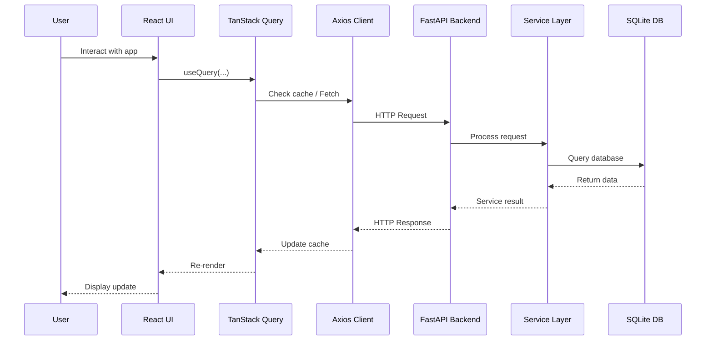
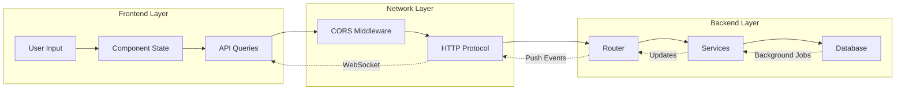

# Storyloop System Architecture Diagram

## Component Diagram

```mermaid
graph TB
    subgraph "Browser"
        UI[React UI]
        Query[TanStack Query]
        API_Client[Axios Client]
    end

    subgraph "Backend Server"
        FastAPI[FastAPI App]
        Router[Routers]
        Service[Services]
        DB_Factory[DB Factory]
    end

    subgraph "External Services"
        YT_API[YouTube API]
        Logfire[Logfire]
    end

    subgraph "Storage"
        SQLite[(SQLite Database)]
        AssetsDir[(Assets Directory)]
    end

    UI --> Query
    Query --> API_Client
    API_Client -->|HTTP REST| FastAPI
    FastAPI --> Router
    Router --> Service
    Service --> DB_Factory
    DB_Factory --> SQLite
    Service --> AssetsDir

    Service -.->|Future| YT_API
    FastAPI -.->|Optional| Logfire

    style UI fill:#61dafb
    style FastAPI fill:#009485
    style SQLite fill:#003B57
```



## Request Flow Sequence



## Data Flow Overview



## Architecture Layers

```
┌─────────────────────────────────────────────────────────────┐
│                    PRESENTATION LAYER                        │
│  ┌──────────────┐  ┌──────────────┐  ┌──────────────┐      │
│  │   Components │  │   React UI   │  │  Styling     │      │
│  └──────┬───────┘  └──────┬───────┘  └──────┬───────┘      │
└─────────┼──────────────────┼──────────────────┼──────────────┘
          │                  │                  │
┌─────────┼──────────────────┼──────────────────┼──────────────┐
│         │    STATE LAYER   │                  │              │
│         │  ┌──────────────┐│                  │              │
│         │  │ Query Cache  ││                  │              │
│         │  └──────┬───────┘│                  │              │
│         └─────────┼────────┘                  │              │
└───────────────────┼───────────────────────────┼──────────────┘
                    │                           │
┌───────────────────┼───────────────────────────┼──────────────┐
│          COMMUNICATION LAYER                  │              │
│         ┌──────────────┐                     │              │
│         │ Axios Client │                      │              │
│         └──────┬───────┘                      │              │
└────────────────┼──────────────────────────────┼──────────────┘
                 │                              │
                 │ HTTP                         │
                 │                              │
┌────────────────┼──────────────────────────────┼──────────────┐
│         API LAYER                             │              │
│   ┌─────────────┐    ┌─────────────┐        │              │
│   │   Routers   │    │   Middleware│        │              │
│   └──────┬──────┘    └──────┬───────┘        │              │
└──────────┼──────────────────┼─────────────────┼──────────────┘
           │                  │                 │
┌──────────┼──────────────────┼─────────────────┼──────────────┐
│    BUSINESS LOGIC LAYER                      │              │
│   ┌─────────────┐    ┌─────────────┐        │              │
│   │  Services   │    │   Scheduler  │        │              │
│   └──────┬──────┘    └──────┬───────┘        │              │
└──────────┼──────────────────┼─────────────────┼──────────────┘
           │                  │                 │
┌──────────┼──────────────────┼─────────────────┼──────────────┐
│      DATA LAYER                              │              │
│    ┌─────────────┐                           │              │
│    │   SQLite    │                           │              │
│    └─────────────┘                           │              │
└───────────────────────────────────────────────┘              │
```

## Service Dependencies

```
FastAPI Application
│
├── Settings (config.py)
│   ├── Environment variables
│   ├── Database URL
│   ├── API keys
│   └── CORS origins
│
├── Database (db.py)
│   └── Connection factory
│
├── Services
│   ├── YoutubeService
│   │   └── YouTube API integration
│   ├── EntryService
│   │   └── Journal + timeline entries
│   ├── AssetService
│   │   └── Uploaded files + metadata
│   └── Agent Service (agent.py)
│       └── PydanticAI agent builder
│
├── Database Helpers (db_helpers/)
│   └── conversations.py
│       └── Conversation/turn persistence
│
└── Routers
    ├── Health endpoint
    └── Conversations endpoint (SSE streaming)
```

## User Experience Flow

```
┌─────────────────────────────────────────────────────────────┐
│                    FIRST-TIME LOGIN                         │
├─────────────────────────────────────────────────────────────┤
│ 1. User opens application                                   │
│ 2. System checks for saved channel preference               │
│ 3. No channel found → Show channel selection dialog         │
│ 4. User selects YouTube channel                             │
│ 5. Save channel preference to backend                       │
│ 6. Load dashboard                                           │
└─────────────────────────────────────────────────────────────┘
                           │
                           ▼
┌─────────────────────────────────────────────────────────────┐
│                    DASHBOARD LAYOUT                         │
├─────────────────────────────────────────────────────────────┤
│ ┌───────────────────────────────────────────────────────┐  │
│ │         TIMELINE SECTION                              │  │
│ │  - Content (videos, lives, shorts, posts, etc.)       │  │
│ │  - Journal entries (simple user-created entries)     │  │
│ │  All displayed chronologically                         │  │
│ └───────────────────────────────────────────────────────┘  │
└─────────────────────────────────────────────────────────────┘
                           │
                           ▼
┌─────────────────────────────────────────────────────────────┐
│                  SUBSEQUENT LOGINS                         │
├─────────────────────────────────────────────────────────────┤
│ 1. User opens application                                   │
│ 2. System automatically loads saved channel preference     │
│ 3. Display dashboard with timeline                         │
│ 4. No prompt needed unless user changes settings            │
└─────────────────────────────────────────────────────────────┘
```

## Technology Stack

```
┌─────────────────────────────────────────────┐
│           FRONTEND STACK                    │
├─────────────────────────────────────────────┤
│ React 18         │ TypeScript               │
│ Vite             │ TanStack Query           │
│ Axios            │ Tailwind CSS             │
│ shadcn/ui        │ Vitest                   │
└─────────────────────────────────────────────┘
                    │
                    │ HTTP/REST
                    │
┌─────────────────────────────────────────────┐
│           BACKEND STACK                      │
├─────────────────────────────────────────────┤
│ FastAPI          │ Python 3.11              │
│ Pydantic         │ SQLite                   │
│ PydanticAI       │ Logfire                  │
│ Uvicorn          │ pytest                   │
└─────────────────────────────────────────────┘
```
